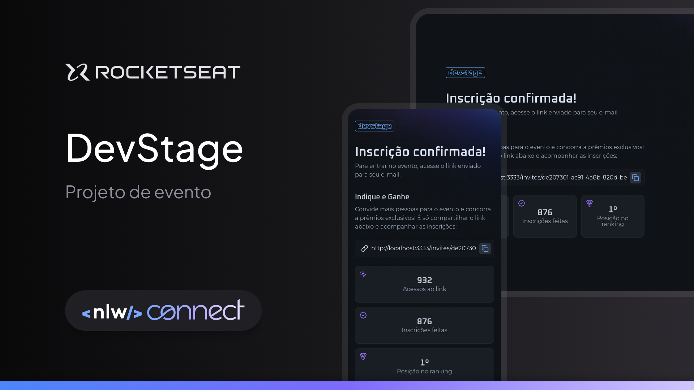

# NLW Connect |  Rocketseat.

Um evento para desenvolver uma aplicação com um Front-end e Back-end para com inscrição e indicação para eventos.

# Trilha React

Front-end com Next.js e Tailwind, com um site responsivo de inscrição e indicação para eventos.

### Tecnologias
- [Next.js](https://nextjs.org)
- [TypeScript](https://www.typescriptlang.org)
- [Tailwind CSS](https://tailwindcss.com)
- [Biome](https://biomejs.dev)

# Trilha Nodejs

Back-end com Node e Fastify,com PostgreSQL para inscrição no evento e com Redis para as indicações para eventos.

### Tecnologias
- [Nodejs](https://nodejs.org)
- [TypeScript](https://www.typescriptlang.org)
- [PostgreSQL](https://www.postgresql.org)
- [Redis](https://redis.io)
- [Fastify](https://fastify.dev)
- [Biome](https://biomejs.dev)

# Trilha Full-Stack

Versão simplificada da aplicação, com um site em HTML, CSS e TypeScript.

### Tecnologias
- [Vite](https://vite.dev)
- [HTML](https://developer.mozilla.org/HTML)
- [CSS](https://developer.mozilla.org/CSS)
- [TypeScript](https://www.typescriptlang.org)
- [Biome](https://biomejs.dev)
